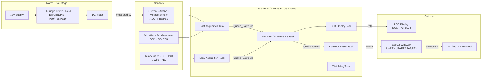

# 🔧 Predictive Maintenance System — STM32F407 + Edge AI

> On-device detection of motor faults (overload, overheating, misalignment...) 
> in real-time, using an embedded neural network and a multi-tasking RTOS architecture.

## 📑 Table of Contents

1. [Why this project](#1-why-this-project)
2. [Global Architecture](#2-global-architecture)
3. [What the system detects](#3-what-the-system-detects)
4. [Data Science & AI Model](#4-data-science--ai-model)
5. [RTOS Architecture](#5-rtos-architecture)
6. [Diagnostics & Performance Proofs](#6-diagnostics--performance-proofs)
7. [LCD Interface](#7-lcd-interface)
8. [Wiring & Hardware](#8-wiring--hardware)
9. [Repository Structure](#9-repository-structure)
10. [Installation & Reproduction](#10-installation--reproduction)
11. [Video Demo](#11-video-demo)
12. [Challenges & Solutions](#12-challenges--solutions)
13. [Known Limitations](#13-known-limitations)
14. [Roadmap](#14-roadmap)
15. [Author & Contact](#15-author--contact)

---

## 1. Why this project

Unplanned motor failure is one of the most expensive problems in industrial maintenance: 
a fault that could have been detected early often turns into a full stoppage, costly repairs, 
or safety risks. Most predictive-maintenance solutions rely on cloud processing, which adds 
latency, bandwidth cost, and a dependency on network availability.

This project explores a different approach: running the fault-detection model **directly on 
the microcontroller**, at the edge, with no cloud dependency. A small induction motor is 
instrumented with voltage, current, temperature, and vibration sensors, and an embedded 
neural network (trained with Edge Impulse) classifies its operating state in real time — 
distinguishing normal operation from four fault conditions (overload, overheating, unexpected 
power loss, and shaft misalignment) across three motor speeds.

Beyond the AI model itself, the project required solving a real engineering problem: sensor 
readings drift with ambient conditions over time (the training data was acquired in summer, 
while testing happened in autumn), and the system needed a calibration strategy that corrects 
the AI's input without ever altering the raw values shown on the display or logged for 
diagnostics — a constraint treated as non-negotiable throughout development.

This project was developed independently from scratch to demonstrate practical expertise 
in end-to-end embedded systems, real-time operating systems (RTOS), and applied edge AI.

## 2. Global Architecture

The system is organized around a FreeRTOS (CMSIS-RTOS2) multi-task architecture running on 
an STM32F407 Discovery board. Each task has a dedicated responsibility, communicating through 
queues and a mutex-protected UART channel. Hardware peripherals span multiple buses — ADC, 
1-Wire, SPI, and I2C — while an H-bridge driver stage controls the motor and an ESP32 WROOM 
module relays diagnostic data to a PC terminal over UART.

- **Motor Drive Stage**: a 12V-powered H-bridge shield drives the DC motor, controlled by the 
  STM32 through `ENA` (PE9), `IN1` (PE8), and `IN2` (PE10) — enabling direction and on/off 
  control from firmware.
- **Fast Acquisition Task** (high priority): reads current (ACS712), voltage, and vibration; 
  applies motor on/off detection and exponential smoothing.
- **Slow Acquisition Task** (low priority): reads temperature and auto-calibrates the 
  temperature offset while the motor is stopped.
- **Decision / AI Inference Task** (normal priority, 8192-word stack): applies calibration 
  gains to sensor data, runs the Edge Impulse classifier, and raises a critical-anomaly flag 
  above a 0.80 confidence threshold.
- **Communication Task**: streams calibrated readings and diagnostics over UART (USART2) to 
  an ESP32 WROOM module, protected by a mutex with native priority inheritance.
- **LCD Display Task**: shows motor state, live sensor values, and short fault labels on a 
  20x4 I2C LCD, with automatic I2C bus recovery on communication failure.
- **Watchdog Task**: lightweight monitoring loop (no hardware IWDG currently active).

