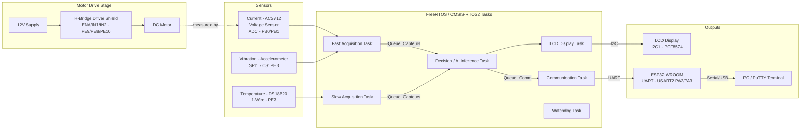

# 🔧 Predictive Maintenance System — STM32F407 + Edge AI

> On-device detection of motor faults (overload, overheating, misalignment...) 
> in real-time, using an embedded neural network and a multi-tasking RTOS architecture.

## 📑 Table of Contents

1. [Why this project](#1-why-this-project)
2. [Global Architecture](#2-global-architecture)
3. [What the system detects](#3-what-the-system-detects)
4. [Data Science & AI Model](#4-data-science--ai-model)
5. [RTOS Architecture](#5-rtos-architecture)
6. [Diagnostics & Performance Proofs](#6-diagnostics--performance-proofs)
7. [LCD Interface](#7-lcd-interface)
8. [Wiring & Hardware](#8-wiring--hardware)
9. [Repository Structure](#9-repository-structure)
10. [Installation & Reproduction](#10-installation--reproduction)
11. [Video Demo](#11-video-demo)
12. [Challenges & Solutions](#12-challenges--solutions)
13. [Known Limitations](#13-known-limitations)
14. [Roadmap](#14-roadmap)
15. [Author & Contact](#15-author--contact)

---

## 1. Why this project

Unplanned motor failure is one of the most expensive problems in industrial maintenance: 
a fault that could have been detected early often turns into a full stoppage, costly repairs, 
or safety risks. Most predictive-maintenance solutions rely on cloud processing, which adds 
latency, bandwidth cost, and a dependency on network availability.

This project explores a different approach: running the fault-detection model **directly on 
the microcontroller**, at the edge, with no cloud dependency. A small induction motor is 
instrumented with voltage, current, temperature, and vibration sensors, and an embedded 
neural network (trained with Edge Impulse) classifies its operating state in real time — 
distinguishing normal operation from four fault conditions (overload, overheating, unexpected 
power loss, and shaft misalignment) across three motor speeds.

Beyond the AI model itself, the project required solving a real engineering problem: sensor 
readings drift with ambient conditions over time (the training data was acquired in summer, 
while testing happened in autumn), and the system needed a calibration strategy that corrects 
the AI's input without ever altering the raw values shown on the display or logged for 
diagnostics — a constraint treated as non-negotiable throughout development.

This project was developed independently from scratch to demonstrate practical expertise 
in end-to-end embedded systems, real-time operating systems (RTOS), and applied edge AI.

## 2. Global Architecture

The system is organized around a FreeRTOS (CMSIS-RTOS2) multi-task architecture running on 
an STM32F407 Discovery board. Each task has a dedicated responsibility, communicating through 
queues and a mutex-protected UART channel. Hardware peripherals span multiple buses — ADC, 
1-Wire, SPI, and I2C — while an H-bridge driver stage controls the motor and an ESP32 WROOM 
module relays diagnostic data to a PC terminal over UART.

- **Motor Drive Stage**: a 12V-powered H-bridge shield drives the DC motor, controlled by the 
  STM32 through `ENA` (PE9), `IN1` (PE8), and `IN2` (PE10) — enabling direction and on/off 
  control from firmware.
- **Fast Acquisition Task** (high priority): reads current (ACS712), voltage, and vibration; 
  applies motor on/off detection and exponential smoothing.
- **Slow Acquisition Task** (low priority): reads temperature and auto-calibrates the 
  temperature offset while the motor is stopped.
- **Decision / AI Inference Task** (normal priority, 8192-word stack): applies calibration 
  gains to sensor data, runs the Edge Impulse classifier, and raises a critical-anomaly flag 
  above a 0.80 confidence threshold.
- **Communication Task**: streams calibrated readings and diagnostics over UART (USART2) to 
  an ESP32 WROOM module, protected by a mutex with native priority inheritance.

## 3. What the system detects

The system continuously monitors a DC motor driven through the H-bridge stage described above, 
currently configured at **70% of maximum voltage** (PWM duty cycle, validated across three 
motor speeds — 100%, 85%, and 70% of Vmax — during dataset acquisition and testing).

Two separate decision layers are deliberately kept apart:

- **Motor state (ON/OFF)** is a simple deterministic rule, not inferred by the AI: voltage 
  above 5.0 V means running, below 2.0 V for a confirmed 3-second window means stopped. 
  This hysteresis avoids false stop/start detection from voltage ripple.
- **Fault classification** among five operating states is handled by an on-device neural 
  network (Edge Impulse), triggered only while the motor is confirmed running.

### Operating states

| State (raw model label) | Displayed as | What it represents |
|---|---|---|
| `vide` | **Normal operation** | Motor running within expected electrical and mechanical range |
| `surcharge` | **Overload** | Abnormal current/torque draw beyond nominal operating range |
| `*tem*` | **Overheating** | Motor temperature drift beyond expected thermal profile |
| `OFON` | **Unexpected power interruption** | Unplanned ON/OFF power cut detected mid-operation |
| `coax` | **Shaft misalignment (coaxiality fault)** | Vibration signature consistent with a misaligned shaft |

### Detection pipeline

1. Six channels (voltage, current, temperature, and 3-axis vibration) are sampled every 
   **6 ms** by the Fast Acquisition task.
2. Samples accumulate into a **600-value inference window** (100 packets × 6 channels ≈ 
   600 ms of real motor behavior).
3. Once full, the window is handed to the Edge Impulse classifier (`run_classifier`), which 
   returns a probability for each of the 5 classes.
4. The highest-probability class is selected as the current prediction.
5. If that prediction is **not** "normal operation" **and** its confidence is **≥ 80%**, a 
   critical-anomaly flag is raised immediately to the Communication task, which broadcasts 
   a formatted alert over UART and updates the LCD with a short fault label.

This two-threshold design (confidence gate + motor-running gate) was a deliberate choice to 
avoid two failure modes: reacting to noise while the motor is off, and reacting to a 
low-confidence, ambiguous classification during transient states.
- **LCD Display Task**: shows motor state, live sensor values, and short fault labels on a 
  20x4 I2C LCD, with automatic I2C bus recovery on communication failure.
- **Watchdog Task**: lightweight monitoring loop (no hardware IWDG currently active).

## 4. Data Science & AI Model

### Dataset

Data was collected directly from the physical motor test bench using the Edge Impulse data 
acquisition pipeline, with one labeled recording per fault-type/speed combination:

| Fault family | Recorded at |
|---|---|
| Normal operation (`vide`) | 70% |
| Overload (`surcharge`) | 70%, 85%, 100% (`max`) |
| Overheating (`temprature`) | 70%, 85%, 100% (`max`) |
| Unexpected power interruption (`OFON`) | 85%, 100% (`max`) |
| Shaft misalignment (`coax` / `coaxiale`) | 70%, 85%, 100% (`max`) |

This produced **12 fine-grained training labels** (one per recording) rather than 5 abstract 
classes — a deliberate choice to preserve as much training signal as possible from a small, 
manually-acquired dataset. At inference time, the firmware deterministically maps these 12 
raw labels back to 5 operator-facing states (see Section 3) by matching the fault-family 
substring in the label name.

- **Total data collected:** 49m 15s raw (40m 28s used for training)
- **Train / test split:** 12 / 3 samples (82% / 18%)
- **Generated training windows:** 4,839

### Signal processing pipeline

Two different feature-extraction strategies are applied depending on the nature of each 
signal, rather than running one generic DSP block across all six channels:

| Signal type | Channels | Block | Features extracted |
|---|---|---|---|
| Slow-varying electrical / thermal | Tension_V, Courant_A, Temperature_C | **Flatten** | Average, min, max, RMS, standard deviation, skewness, kurtosis |
| High-frequency mechanical | Vibration_X, Vibration_Y, Vibration_Z | **Spectral Analysis** | FFT (length 128, log spectrum, overlapping frames) |

- **Window size:** 1000 ms, **stride:** 500 ms, **sampling frequency:** 100 Hz
- Features are normalized using scikit-learn's `StandardScaler` before training

Feature importance analysis (computed by Edge Impulse over the full training set) ranks 
**Courant_A Average** and **Tension_V Average** as the two most discriminative features 
overall — the electrical signature of the motor carries more separating power than vibration 
alone for most fault types, while **Vibration_X Kurtosis** and **Vibration_Z RMS** are the 
strongest indicators within the vibration feature set specifically (relevant for the 
coaxiality/misalignment fault).

### Model architecture

A fully-connected (dense) neural network was chosen over a convolutional architecture, after 
iterating through several configurations:
Dense(512, relu) → Dropout(0.4)
→ Dense(256, relu) → Dropout(0.3)
→ Dense(128, relu) → Dropout(0.2)
→ Dense(64, relu) → Dropout(0.1)
→ Dense(32, relu)
→ Dense(12, softmax)

- **Optimizer:** Adam (learning rate 1e-4, β1=0.9, β2=0.999)
- **Loss:** categorical cross-entropy
- **Batch size:** 32, up to 500 epochs
- **Class imbalance** handled via computed class weights (inversely proportional to class 
  frequency)
- **Regularization:** `ReduceLROnPlateau` (factor 0.5, patience 15) and `EarlyStopping` 
  (patience 35, best-weights restoration)

An earlier iteration of this architecture reached 84.5% accuracy / 0.39 loss; after further 
tuning of the class-weighting strategy, the final retrained model reached the results below.

### Final performance (validation set)

| Metric | Value |
|---|---|
| Accuracy | **87.0%** |
| Loss | 0.40 |
| Weighted precision | 0.87 |
| Weighted recall | 0.87 |
| Weighted F1-score | 0.87 |
| AUC-ROC | 0.99 |

Per-class F1-scores range from 0.75 (`OFON_85`, the hardest class to separate) to 0.95 
(`temprature_85`), with most fault classes above 0.83 — the full confusion matrix is kept in 
the project's Edge Impulse workspace for reference.

### Deployment

The trained impulse is exported as a **portable C++ library** (no external dependencies) 
and compiled into the firmware through Edge Impulse's `EON™ Compiler`, with the **INT8 
quantized** model variant selected over float32 — same accuracy class, with 52% less RAM and 
35% less flash usage.

| | Quantized (INT8) — deployed | Unoptimized (float32) |
|---|---|---|
| Classifier latency | 5 ms | 30 ms |
| Peak RAM | 5.7 KB | 5.7 KB |
| Flash footprint | 302.6 KB | 1.1 MB |

> These figures are Edge Impulse's benchmark on a generic Cortex-M4F reference target 
> (80 MHz). The STM32F407 Discovery's Cortex-M4F core runs at up to 168 MHz, so real on-device 
> latency is expected to be at or below these numbers.

A secondary **GMM-based anomaly detection block** (12 components, trained on current and 
voltage averages) was also explored in Edge Impulse as an unsupervised complement to the 
classifier, but is not currently invoked by the firmware, which relies solely on the 
supervised classifier's output.

